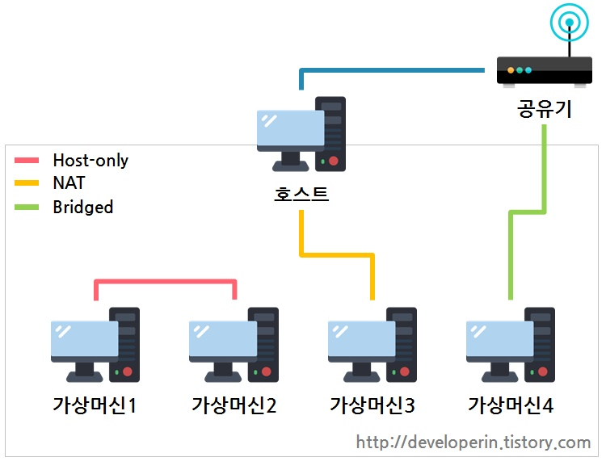
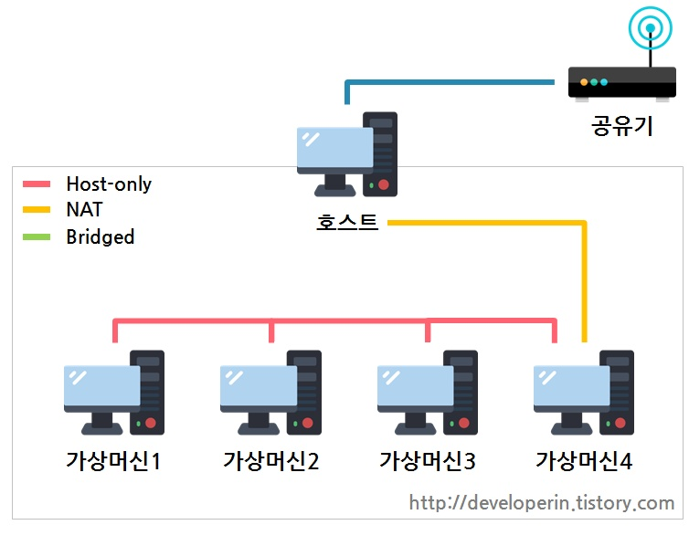

# Host-only, NAT, Bridged

1. Host-only : 외부와 단절된 내부 네크워크 구축, 구성된 가상머신끼리만 통신 간으
2. NAT(Network Address Translation) : 호스트pc로부터 ip를 할당 받아 자체 DHCP를 통해 내부 네트워크 대역 할당 및 통신. 호스트pc를 통해 외부 네트워크와 통신가능.
3. Bridge : 공유기로부터 ip를 직접 할당 받는 것.

### 가상 네트워크 구성 응용 예시

출처 : https://developerin.tistory.com/18

